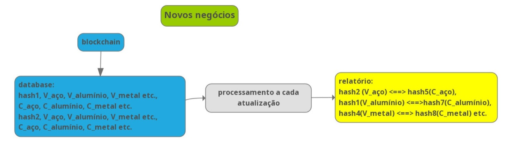
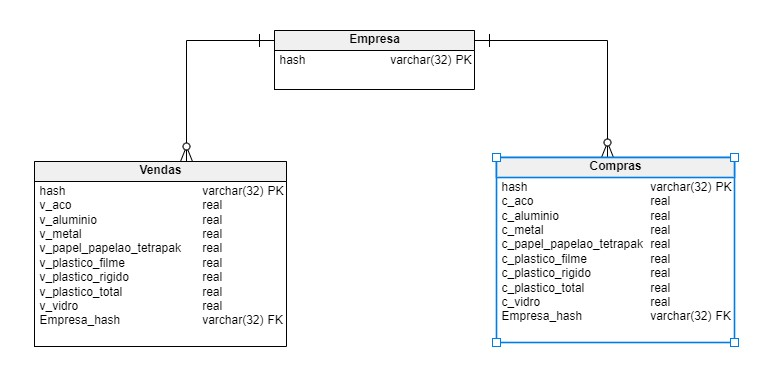
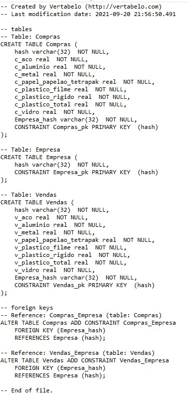
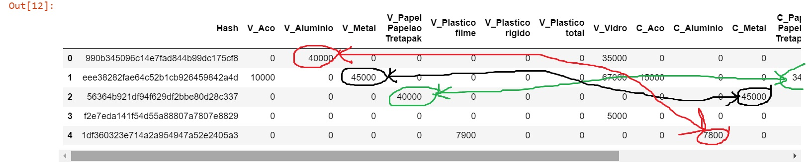

# Alysida - Novos Mercados


O site de **Alysida** está em http://alysida.com.br/?p=6

Os dados são carregados a partir da inscrição do usuário na Blockchain.

São processados a cada atualização e é gerado o relatório com as iterações.



## O banco de dados

Para fazer o "match" entre compradores e vendedores, os dados necessitam ser armazenados em um sistema gerenciador de banco de dados, conforme o modelo conceitual e script de criação apresentados abaixo. 

Esse database será processado a cada novo registro e irá estabelecer as ligações de compra e venda dos usuários. 







No banco de dados, os campos das tabelas de compra e de venda preenchidos com 0 ( zero) significam que o usuário não tem resíduo a vender ou a comprar.

O valor numérico representa a quantidade em quilos - número real e positivo - do resíduo que se quer vender ou comprar.

### Lê o dataset gerado
```
import pandas as pd
import datetime 
df = pd.read_csv ("novosmercados.csv")
```

## As iterações descobertas

A cada novo hash registrado no **Alysida**, e que tenha valor diferente de zero nas colunas de compra e venda, o sistema é processado. Como exemplo de processamento, podemos observar abaixo, que o hash(empresa) zero, possui 40.000 Kg de alumínio para venda e o hash 4, deseja comprar 7800 Kg de alumínio. O mesmo será realizado para as demais empresas.


## O relatório dos Novos Mercados descobertos

Como exemplo de saída deste subsistema do **Alysida**, o relatório abaixo apresenta o hash do vendedor, o resíduo e quantidade <==> o hash do comprador, o resíduo e quantidade.
```
print('990b345096c14e7fad844b99dc175cf8, V_Alumínio, 40000 <==> 1df360323e714a2a954947a52e2405a3, C_Alumínio, 7800')
print('eee38282fae64c52b1cb926459842a4d, V_Metal, 45000 <==> 56364b921df94f629df2bbe80d28c337, C_Metal, 45000')
print('56364b921df94f629df2bbe80d28c337, V_Papel Papelão Tretapak, 40000 <==> eee38282fae64c52b1cb926459842a4d, C_Papel Papelão Tretapak, 3400')
```

**990b345096c14e7fad844b99dc175cf8, V_Alumínio, 40000 <==> 1df360323e714a2a954947a52e2405a3, C_Alumínio, 7800**
**eee38282fae64c52b1cb926459842a4d, V_Metal, 45000 <==> 56364b921df94f629df2bbe80d28c337, C_Metal, 45000**
**56364b921df94f629df2bbe80d28c337, V_Papel Papelão Tretapak, 40000 <==> eee38282fae64c52b1cb926459842a4d, C_Papel Papelão Tretapak, 3400**


